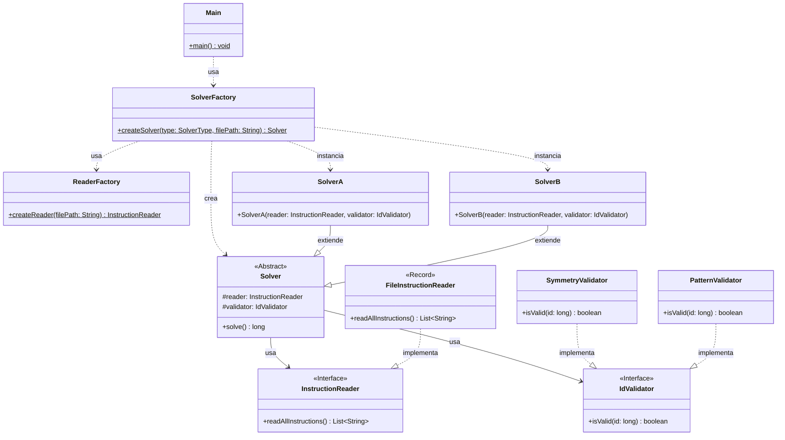

# Advent of Code 2025 - Día 2: Sistema de Gestión de Inventario

Este proyecto contiene la solución para el **Día 2** del Advent of Code 2025. El desafío consiste en identificar IDs de productos "inválidos" dentro de rangos específicos basándose en patrones de dígitos repetidos.

## Diseño y Arquitectura

En este proyecto se aplican estrictamente los principios SOLID y Clean Code, junto con patrones de diseño estratégicos para garantizar un código mantenible, extensible y testeable.

### 1. Principios SOLID

- **Single Responsibility Principle (SRP)**:
  - `ReaderFactory` y `SolverFactory`: Responsables únicamente de la creación de objetos.
  - `FileInstructionReader`: Responsable de la lectura de archivos.
  - `SolverA` / `SolverB`: Coordinan la lógica específica para cada parte del problema (estrategias concretas).
  - `SymmetryValidator` / `PatternValidator`: Encapsulan la lógica de validación de negocio.
- **Open/Closed Principle (OCP)**:
  - El sistema es extensible mediante interfaces y clases abstractas. Se pueden agregar nuevos tipos de `InstructionReader` o nuevas implementaciones de `Solver` sin modificar el código existente en `Main` o en las lógicas bases.
  - Para agregar una nueva regla de validación, basta con crear una nueva implementación de `IdValidator`.
- **Liskov Substitution Principle (LSP)**:
  - `SolverA` y `SolverB` son intercambiables a través de la clase abstracta `Solver`.
  - `FileInstructionReader` puede ser sustituido por cualquier otra implementación de `InstructionReader` sin romper el sistema.
- **Interface Segregation Principle (ISP)**:
  - Las interfaces `InstructionReader` e `IdValidator` son específicas y definen contratos claros sin métodos innecesarios.
- **Dependency Inversion Principle (DIP)**:
  - Los módulos de alto nivel (`Main`, `SolverA`, `SolverB`) dependen de abstracciones (`Solver`, `InstructionReader`, `IdValidator`), no de implementaciones concretas.

### 2. Patrones de Diseño

Se han implementado patrones de diseño para resolver problemas de creación y comportamiento:

- **Strategy Pattern (Estrategia)**:

  - La clase abstracta `Solver` define la estructura del algoritmo (`solve`), delegando la validación específica a la estrategia `IdValidator` inyectada.
  - `SolverA` y `SolverB` actúan como estrategias concretas de solución que configuran el entorno para cada parte del problema.
  - `SymmetryValidator` y `PatternValidator` son estrategias de validación intercambiables.

- **Factory Pattern (Fábrica)**:

  - `SolverFactory`: Centraliza la creación de los Solvers. Basado en un parámetro (`SolverType`), decide qué estrategia de solver instanciar e inyecta las dependencias necesarias.
  - `ReaderFactory`: Abstrae la creación del lector de instrucciones, facilitando cambios futuros en el origen de datos.

- **Dependency Injection**:
  - Las dependencias (`InstructionReader`, `IdValidator`) se inyectan en los constructores de los Solvers.

### 3. Diagrama de Arquitectura

### 4. Estructura del Proyecto

La estructura de paquetes refleja la separación de responsabilidades:

- `software.aoc.day02`: Clases base abstractas, interfaces comunes y fábricas (`Solver`, `SolverFactory`, `ReaderFactory`, `IdValidator`, etc.).
- `software.aoc.day02.a`: Implementación concreta para la Parte 1 (`SolverA`, `SymmetryValidator`).
- `software.aoc.day02.b`: Implementación concreta para la Parte 2 (`SolverB`, `PatternValidator`).
