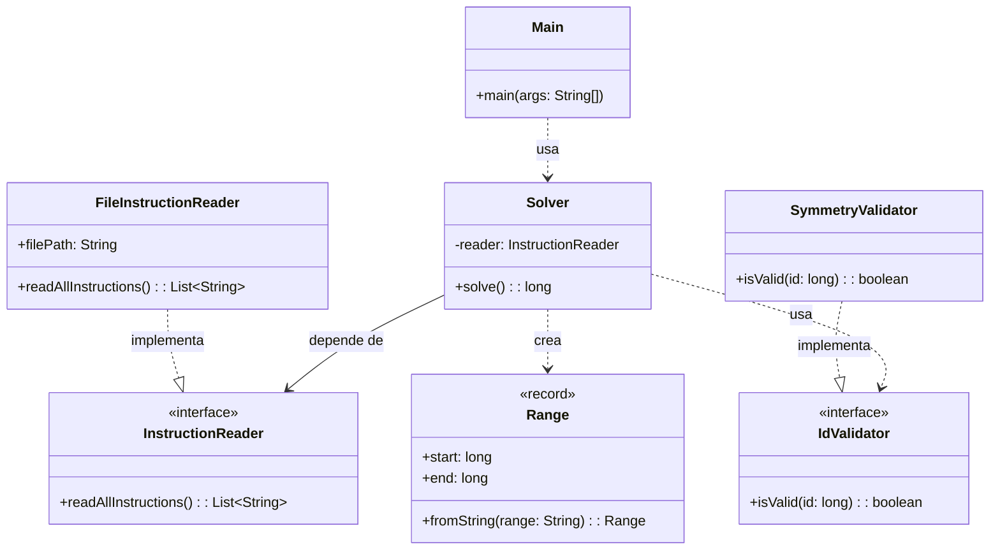
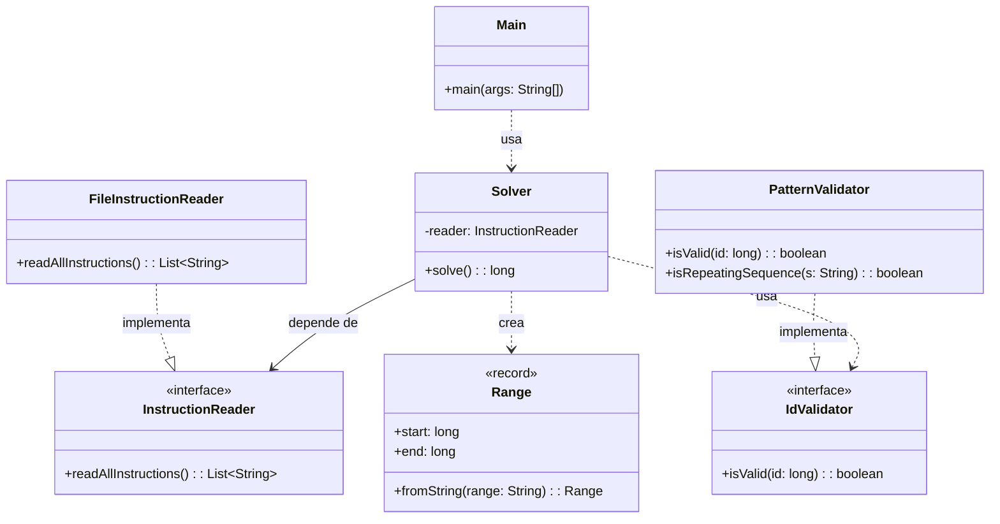

# Advent of Code 2025 - Día 2: Sistema de Gestión de Inventario

Este repositorio contiene la solución para el Día 2 del Advent of Code 2025. El desafío consiste en identificar IDs de productos "inválidos" dentro de rangos específicos basándose en patrones de dígitos repetidos.

## Descripción del Problema

Los elfos de la tienda de regalos del Polo Norte han añadido accidentalmente IDs de productos inválidos a su base de datos. Se nos proporciona una lista de rangos de IDs (por ejemplo, `11-22`, `95-115`) y necesitamos encontrar la suma de todos los IDs inválidos dentro de estos rangos.

### Parte 1

Un ID se considera **inválido** si consiste en una secuencia de dígitos repetida exactamente **dos veces**.

- Ejemplos: `55` (5 repetido dos veces), `6464` (64 repetido dos veces).
- No ejemplos: `101` (válido).

### Parte 2

La definición de un ID inválido se expande. Un ID ahora es **inválido** si consiste en una secuencia de dígitos repetida **al menos dos veces**.

- Ejemplos: `12341234` (1234 dos veces), `123123123` (123 tres veces), `1111111` (1 siete veces).

## Estructura del Proyecto

El proyecto es una aplicación Java organizada usando Maven. La solución está dividida en dos paquetes para cada parte del desafío:

- `src/main/java/software/aoc/day02/a`: Contiene la solución para la Parte 1.
  - `Main.java`: Punto de entrada, lee los rangos y suma los IDs inválidos.
  - `Range.java`: Lógica para generar números en un rango y validarlos (comprobar si al dividirlos por la mitad son iguales).
  - `FileInstructionReader.java`: Ayudante para leer el archivo de entrada.
- `src/main/java/software/aoc/day02/b`: Contiene la solución para la Parte 2.
  - `Main.java`: Punto de entrada para la Parte 2.
  - `Range.java`: Lógica para generar números y delegar la validación.
  - `PatternValidator.java`: Lógica para comprobar si un número está formado por _cualquier_ secuencia repetida (no solo dividido por la mitad).

## Arquitectura y Principios de Diseño

El diseño de la solución se basa en la modularidad y la claridad, aplicando principios de ingeniería de software para asegurar que el código sea mantenible, testeable y extensible.

### Diagramas de Clases

#### Parte 1: Simetría Estricta

#### Parte 2: Patrones Repetidos

### Principios SOLID aplicados

- **Single Responsibility Principle (SRP)**:

  - `Solver`: Orquestador puro. No sabe cómo leer archivos ni cómo validar. Solo coordina.
  - `FileInstructionReader`: Se encarga exclusivamente de interactuar con el sistema de archivos.
  - `Range`: Es un record, sin lógica de validación ni bucles.
  - `SymmetryValidator` / `PatternValidator`: Encapsulan la lógica pura de negocio para cada regla específica.

- **Dependency Inversion Principle (DIP)**:

  - La clase `Solver` depende de la abstracción (interfaz) `InstructionReader`, no de la implementación concreta `FileInstructionReader`. Esto permite cambiar el origen de datos (e.g., a una API Mock) sin tocar la lógica del solver.

- **Open/Closed Principle (OCP)**:
  - Gracias a la interfaz `IdValidator`, es posible añadir nuevas reglas de validación creando nuevas clases que implementen la interfaz, sin modificar el código existente en `Solver`.

### Clean Code y Decisiones Técnicas

- **Inmutabilidad**: Uso de `record` para `Range` y `FileInstructionReader`.
- **Streams Declarativos**: Uso de `java.util.stream` para un flujo de datos legible y eficiente.
- **Separación de Preocupaciones**: La lógica de "qué es un rango" está separada de "qué es un ID válido".
